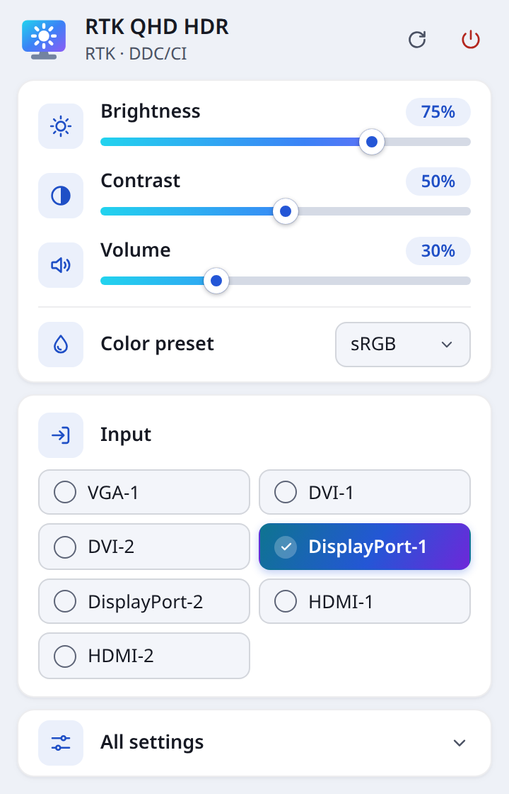
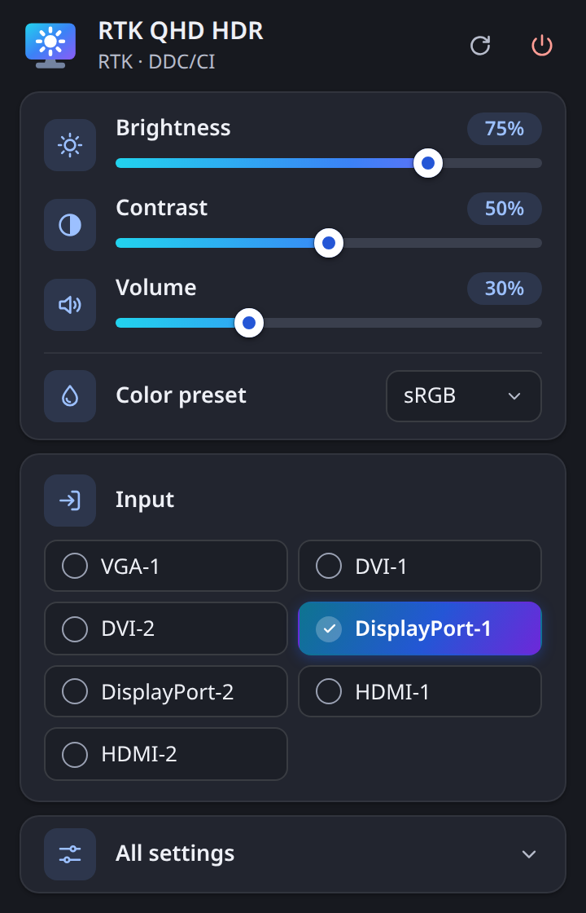
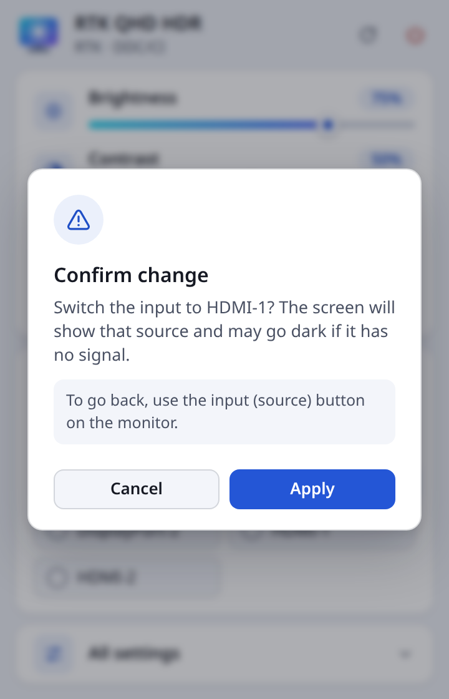

# ddc-control

Control everything your monitor's physical OSD offers — brightness, contrast, input source, color preset, volume, power — from software, over DDC/CI, with the same Rust binary on Windows and Linux.

**Status:** pre-alpha. Phases 1 (`core-domain`), 2 (`ddc-backends`), 3 (`cli`), 4 (`full-osd-control`) and 5 (`tray-app`) are implemented: the `ddc-cli` binary lists monitors, shows their capabilities, lists every feature with its current value, probes the ones the capabilities leave out, and reads and writes features by name, with factory resets behind `--yes`; the `ddc-tray` app puts the everyday controls in a popup behind a system-tray icon (see [Tray app](#tray-app)). Reads are validated on real hardware. Writes pass the same checks and are tested against the in-memory backend; on real hardware only the tray's hardware test has written so far, one brightness change on the dev monitor, restored right after. The tray runs on Linux (KDE Plasma); on Windows it has not been built yet. CI and installers come next (phases `ci-crossbuild` and `release-packaging`). See `.jdi/ROADMAP.md` (run `npx -y jdi-cli render` to regenerate it).

## Install

```sh
cargo install --path crates/ddc-cli --locked
```

On Linux your user needs access to `/dev/i2c-*` first: see [`docs/linux-ddc-setup.md`](docs/linux-ddc-setup.md). Never run `ddc-cli` with `sudo`.

The tray app has no installer or package yet: build and run it from the repository, as described in [Tray app](#tray-app).

## Usage

```text
ddc-cli list                          monitors reachable over DDC/CI, numbered from 1
ddc-cli caps [--refresh]              the monitor's parsed capabilities string
ddc-cli features [--probe]            every feature with its current value
ddc-cli get <vcp>                     read a feature
ddc-cli set <vcp> <value> [--yes]     write a feature and read it back
ddc-cli reset <target> [--yes]        restore factory defaults
```

Global options go before or after the subcommand:

- `--monitor`/`-m <id|index>` picks the monitor. Without it, the only monitor is used; with none or several attached the command fails and lists them. The value is tried as an exact id, then, when it is all digits, as the index shown by `list` (an index out of range is an error, never a partial id match), then as a case-insensitive part of exactly one id. A part of several ids fails and lists the candidates. `list` ignores it.
- `--json` prints the result as JSON, numbers in decimal. Errors and warnings always go to stderr as text, so scripts parse stdout and check the exit code.

### Features by name

`<vcp>` is a code in decimal (`16`) or hex (`0x10`), or the name the [feature catalog](#feature-catalog) gives it, case-insensitive: `brightness`, `preset`, `osd-language`, `red-black-level`, `v-frequency`… The six names of earlier versions (`brightness`, `contrast`, `input`, `preset`, `volume`, `power`) keep their codes.

`<value>` is decimal or hex, up to 65535, or the name of a value: `set preset srgb`, `set preset 6500k`, `set osd-language english`, `set input hdmi-1 --yes`. Case and every character that is not a letter or a digit are ignored, so `6500k`, `6500 K` and `6500-k` all name `6500 K`, and `displayport1` names `DisplayPort-1`. A name is turned into its byte for the feature being set; a name that is no value of that feature (`set brightness srgb`, `set preset nonsense`) is a usage error, exit 2, before any monitor is touched. Whether this monitor accepts the value is the core's decision: `set preset 6500k` on a monitor whose capabilities do not list `6500 K` exits 4 and writes nothing.

`get` and `set` print what the value means when the catalog knows it: `0x14 preset: 1 (0x01) sRGB`, `0xDF vcp-version: 514 (0x202) 2.2`. With `--json` they add `value_name` (a named value) or `interpreted` (a frequency or a version), and leave both out when there is nothing to add, so the JSON of a plain reading is the same as before.

Every write goes through the core's checks (see [Monitor-write safety](#monitor-write-safety)): a dangerous code, including any code outside the catalog, needs `--yes`, and there is never a prompt. The value read back is printed; if it differs from the one written, a warning says the monitor may have ignored the write, JSON reports `"applied": false`, and the exit code is still 0.

### `features`

`features` reads every code the monitor's capabilities declare, one row per code: code, name, type (`C` continuous, `NC` non-continuous, `T` table), access (`RO`, `WO`, `RW`), write risk, where the code comes from (`caps`), the value as `current/max` with its meaning, and the MCCS name. `--probe` also reads every catalogued code the capabilities leave out (source `probe`). A code the monitor refuses shows `not supported by this monitor`; one that does not answer shows `not responding`. Neither fails the command, which only reads and never takes `--yes`. With `--json` the result is an array with `code`, `name`, `description`, `kind`, `access`, `risk`, `declared_in_capabilities`, `probe_status` (`ok`, `unsupported` or `unresponsive`), `current`, `max`, `value_name` and `interpreted`, every field always present (`null` when empty). Capabilities that cannot be read are a warning: no code counts as declared, and `--probe` reads the whole catalog.

### `reset`

`reset <target>` restores factory defaults: `factory` (everything, `0x04`), `brightness-contrast` (`0x05`), `geometry` (`0x06`) or `color` (`0x08`). Every reset is dangerous and needs `--yes`; without it the command exits 5 before anything is read from or written to the monitor. `reset factory --yes` is exactly `set 0x04 reset --yes`: it writes `0x01` (MCCS ignores zero, and any non-zero value triggers the reset) through the same core checks. The reset codes are write-only, so nothing is read back: the command prints the code and what was sent, followed by `(write-only, not read back)`, and JSON reports `"read_back": false`. Resets are never run on real hardware by this project's tests or validation.

### Examples

On the dev machine (Linux, the "RTK QHD HDR" monitor plus an LG TV whose DDC/CI is mute), read-only:

```text
$ ddc-cli list
1  GSM-LG-TV-SSCR2-01010101  (GSM LG TV SSCR2 01010101)
2  RTK-RTK-QHD-HDR-01010101  (RTK RTK QHD HDR 01010101)

$ ddc-cli get brightness
error: 2 monitors found; choose one with --monitor <id|index>:
  1  GSM-LG-TV-SSCR2-01010101  (GSM LG TV SSCR2 01010101)
  2  RTK-RTK-QHD-HDR-01010101  (RTK RTK QHD HDR 01010101)
e.g. --monitor 1 or --monitor GSM-LG-TV-SSCR2-01010101

$ ddc-cli --monitor rtk get brightness
0x10 brightness: 100 (0x64), max 100 (0x64)

$ ddc-cli -m rtk get preset
0x14 preset: 1 (0x01) sRGB, max 11 (0x0B)

$ ddc-cli -m rtk get input
0x60 input: 15 (0x0F) DisplayPort-1, max 3 (0x03)

$ ddc-cli -m 2 get volume
warning: 0x62 volume is not declared in capabilities, or they could not be read; showing what the monitor answered
0x62 volume: 30 (0x1E), max 100 (0x64)

$ ddc-cli -m rtk get brightness --json
{
  "monitor": "RTK-RTK-QHD-HDR-01010101",
  "code": 16,
  "name": "brightness",
  "current": 100,
  "max": 100,
  "declared_in_capabilities": true
}
```

`features` on the same monitor (about 3.7 s, most of it the enumeration and 28 reads):

```text
$ ddc-cli -m rtk features
CODE  NAME                  TYPE  ACCESS  RISK       SOURCE  VALUE                          DESCRIPTION
0x02  new-control-value     NC    RW      safe       caps    1/2                            New Control Value
0x04  -                     NC    WO      dangerous  caps    0/1                            Restore Factory Defaults
0x05  -                     NC    WO      dangerous  caps    0/1                            Restore Factory Luminance/Contrast Defaults
0x06  -                     NC    WO      dangerous  caps    0/1                            Restore Factory Geometry Defaults
0x08  -                     NC    WO      dangerous  caps    0/1                            Restore Factory Color Defaults
0x0B  color-temp-increment  C     RO      safe       caps    100/0                          Color Temperature Increment
0x0C  color-temp            C     RW      safe       caps    10/63                          Color Temperature Request
0x10  brightness            C     RW      safe       caps    100/100                        Luminance
0x12  contrast              C     RW      safe       caps    50/100                         Contrast
0x14  preset                NC    RW      safe       caps    1/11 sRGB                      Select Color Preset
0x16  red-gain              C     RW      safe       caps    50/100                         Video Gain (Red)
0x18  green-gain            C     RW      safe       caps    50/100                         Video Gain (Green)
0x1A  blue-gain             C     RW      safe       caps    50/100                         Video Gain (Blue)
0x52  -                     C     RO      safe       caps    50/100                         -
0x60  input                 NC    RW      dangerous  caps    15/3 DisplayPort-1             Input Source
0x87  sharpness             C     RW      safe       caps    4/4                            Sharpness
0xAC  h-frequency           C     RO      safe       caps    3/41092                        Horizontal Frequency
0xAE  v-frequency           C     RO      safe       caps    14400/65535 144.00 Hz          Vertical Frequency
0xB2  subpixel-layout       NC    RO      safe       caps    1/1                            Flat Panel Sub-Pixel Layout
0xB6  display-technology    NC    RO      safe       caps    3/5                            Display Technology Type
0xC6  -                     C     RO      safe       caps    90/255                         -
0xC8  controller-type       NC    RO      safe       caps    9/0                            Display Controller Type
0xCA  osd-lock              NC    RW      dangerous  caps    1/2 OSD disabled               OSD/Button Control
0xCC  osd-language          NC    RW      safe       caps    2/13 English                   OSD Language
0xD6  power                 NC    RW      dangerous  caps    1/5 On                         Power Mode
0xDF  vcp-version           C     RO      safe       caps    514/65535 2.2                  VCP Version
0xFD  -                     C     RO      safe       caps    not supported by this monitor  -
0xFF  -                     C     RO      safe       caps    not supported by this monitor  -
```

`features --probe` adds the 11 catalogued codes the RTK answers without declaring them (about 5 s). `0x7E` makes `ddc-i2c` 0.2.2 panic; the backend turns that into a transport error, so the row reads `not responding` and Rust's panic message goes to stderr:

```text
$ ddc-cli -m rtk features --probe
CODE  NAME                  TYPE  ACCESS  RISK       SOURCE  VALUE                          DESCRIPTION
0x02  new-control-value     NC    RW      safe       caps    1/2                            New Control Value
0x04  -                     NC    WO      dangerous  caps    0/1                            Restore Factory Defaults
0x05  -                     NC    WO      dangerous  caps    0/1                            Restore Factory Luminance/Contrast Defaults
0x06  -                     NC    WO      dangerous  caps    0/1                            Restore Factory Geometry Defaults
0x08  -                     NC    WO      dangerous  caps    0/1                            Restore Factory Color Defaults
0x0B  color-temp-increment  C     RO      safe       caps    100/0                          Color Temperature Increment
0x0C  color-temp            C     RW      safe       caps    10/63                          Color Temperature Request
0x10  brightness            C     RW      safe       caps    100/100                        Luminance
0x12  contrast              C     RW      safe       caps    50/100                         Contrast
0x14  preset                NC    RW      safe       caps    1/11 sRGB                      Select Color Preset
0x16  red-gain              C     RW      safe       caps    50/100                         Video Gain (Red)
0x18  green-gain            C     RW      safe       caps    50/100                         Video Gain (Green)
0x1A  blue-gain             C     RW      safe       caps    50/100                         Video Gain (Blue)
0x1E  auto-setup            NC    RW      dangerous  probe   0/1 Off                        Auto Setup
0x20  h-position            C     RW      dangerous  probe   0/100                          Horizontal Position
0x30  v-position            C     RW      dangerous  probe   0/100                          Vertical Position
0x52  -                     C     RO      safe       caps    50/100                         -
0x60  input                 NC    RW      dangerous  caps    15/3 DisplayPort-1             Input Source
0x62  volume                C     RW      safe       probe   30/100                         Audio Speaker Volume
0x6C  red-black-level       C     RW      safe       probe   80/100                         Video Black Level (Red)
0x6E  green-black-level     C     RW      safe       probe   80/100                         Video Black Level (Green)
0x70  blue-black-level      C     RW      safe       probe   80/100                         Video Black Level (Blue)
0x7E  trapezoid             C     RW      dangerous  probe   not responding                 Trapezoid
0x87  sharpness             C     RW      safe       caps    4/4                            Sharpness
0xAC  h-frequency           C     RO      safe       caps    3/41092                        Horizontal Frequency
0xAE  v-frequency           C     RO      safe       caps    14400/65535 144.00 Hz          Vertical Frequency
0xB2  subpixel-layout       NC    RO      safe       caps    1/1                            Flat Panel Sub-Pixel Layout
0xB6  display-technology    NC    RO      safe       caps    3/5                            Display Technology Type
0xC6  -                     C     RO      safe       caps    90/255                         -
0xC8  controller-type       NC    RO      safe       caps    9/0                            Display Controller Type
0xC9  firmware-level        C     RO      safe       probe   1/65535 0.1                    Display Firmware Level
0xCA  osd-lock              NC    RW      dangerous  caps    1/2 OSD disabled               OSD/Button Control
0xCC  osd-language          NC    RW      safe       caps    2/13 English                   OSD Language
0xD6  power                 NC    RW      dangerous  caps    1/5 On                         Power Mode
0xDF  vcp-version           C     RO      safe       caps    514/65535 2.2                  VCP Version
0xE6  -                     C     RW      dangerous  probe   0/0                            Manufacturer specific (0xE6)
0xF1  -                     C     RW      dangerous  probe   1/65535                        Manufacturer specific (0xF1)
0xFD  -                     C     RO      safe       caps    not supported by this monitor  -
0xFF  -                     C     RO      safe       caps    not supported by this monitor  -
```

The LG TV is listed because enumeration only reads EDID; its DDC/CI is mute, so reading or writing it fails with exit 6.

### Exit codes

| Code | Meaning |
|---|---|
| 0 | Success |
| 2 | Invalid command line (from `clap`), or a value name that is no value of the feature being set |
| 3 | No single monitor matches: none attached, several without `--monitor`, no match, or an ambiguous match |
| 4 | The feature or value is not valid for the monitor, including a code the monitor answers as unsupported |
| 5 | A dangerous write without `--yes` |
| 6 | The monitor did not answer in time, or the transport failed |

A code the monitor refuses outright (a DDC/CI reply with result code `0x01`, "unsupported VCP code") exits 4 on the first reply, with no retry. `set` gets that reply from the maximum it reads before writing, so nothing is written. A monitor that does not answer, or answers garbage, still exits 6. On the dev monitor, `get 0x8D`, `0x9B`, `0xC0` and `0xDC` exit 4. On Windows `dxva2` decodes the reply itself and reports only an OS error, so there a refused code still exits 6.

### Capabilities cache

Reading a capabilities string takes about 2.5 s on the dev monitor, and every `ddc-cli` run is a new process, so the first successful read per monitor is kept on disk, one file per monitor id:

- Windows: `%LOCALAPPDATA%\ddc-control\caps\`
- Elsewhere: `$XDG_CACHE_HOME/ddc-control/caps/` when that variable is an absolute path, else `~/.cache/ddc-control/caps/`

With the cache warm, a `get` on the dev monitor takes about 1.15 s (the enumeration) instead of about 3.7 s. Failed reads are never cached, and neither are replies the core cannot parse, such as a truncated string; a cached file the core cannot parse is ignored. `caps --refresh` reads the monitor again, and only a successful read replaces the file: a refresh the monitor refuses exits 6 and leaves the previous file for later runs. If none of those directories can be determined, `ddc-cli` runs without a cache.

The cache is keyed by monitor id, and ids built without an EDID serial (the device description on Windows, `index-N`, a `#N` suffix) can move to another monitor after a hotplug, so one monitor's capabilities could be served for another. Risk is decided per code and continuous maxima are read from the monitor, so the worst case is a write checked against the wrong list of allowed values. Run `caps --refresh` after changing monitors.

Some monitors, the dev one included, refuse a capabilities read issued right after the previous one, and keep refusing for a few hundred milliseconds after each failed attempt. Capabilities reads are therefore retried 500 ms apart, where VCP reads and writes wait 200 ms. On the dev monitor, back-to-back `caps --refresh` runs then succeed, taking about 1.6 s longer when the first attempt is refused. If a refresh still fails, wait a few seconds and run it again; the cached file keeps being used meanwhile.

### Feature catalog

The core knows the 39 VCP codes observed on the dev monitor "RTK QHD HDR": the 28 its capabilities declare, the 9 it answers without declaring them, and the 2 manufacturer-specific codes a full read-only scan found answering. The table below is the catalog, one row per code; a code outside it has no name, is written only with `--yes`, and is non-continuous only when the capabilities list its values.

| Code | Name (`<vcp>`) | MCCS name | Type | Access | Write | Value names |
|---|---|---|---|---|---|---|
| `0x02` | `new-control-value` | New Control Value | NC | RW | refused: no value list |  |
| `0x04` | — (`reset`) | Restore Factory Defaults | NC | WO | dangerous, `--yes` | `01` Reset |
| `0x05` | — (`reset`) | Restore Factory Luminance/Contrast Defaults | NC | WO | dangerous, `--yes` | `01` Reset |
| `0x06` | — (`reset`) | Restore Factory Geometry Defaults | NC | WO | dangerous, `--yes` | `01` Reset |
| `0x08` | — (`reset`) | Restore Factory Color Defaults | NC | WO | dangerous, `--yes` | `01` Reset |
| `0x0B` | `color-temp-increment` | Color Temperature Increment | C | RO | never (read-only) |  |
| `0x0C` | `color-temp` | Color Temperature Request | C | RW | safe |  |
| `0x10` | `brightness` | Luminance | C | RW | safe |  |
| `0x12` | `contrast` | Contrast | C | RW | safe |  |
| `0x14` | `preset` | Select Color Preset | NC | RW | safe | `01` sRGB, `02` Display Native, `04` 5000 K, `05` 6500 K, `06` 7500 K, `08` 9300 K, `0B` User 1 |
| `0x16` | `red-gain` | Video Gain (Red) | C | RW | safe |  |
| `0x18` | `green-gain` | Video Gain (Green) | C | RW | safe |  |
| `0x1A` | `blue-gain` | Video Gain (Blue) | C | RW | safe |  |
| `0x1E` | `auto-setup` | Auto Setup | NC | RW | dangerous, `--yes` | `00` Off, `01` Run, `02` Continuous |
| `0x20` | `h-position` | Horizontal Position | C | RW | dangerous, `--yes` |  |
| `0x30` | `v-position` | Vertical Position | C | RW | dangerous, `--yes` |  |
| `0x52` | — | — | C | RO | never (read-only) |  |
| `0x60` | `input` | Input Source | NC | RW | dangerous, `--yes` | `01` VGA-1, `03` DVI-1, `04` DVI-2, `0F` DisplayPort-1, `10` DisplayPort-2, `11` HDMI-1, `12` HDMI-2 |
| `0x62` | `volume` | Audio Speaker Volume | C | RW | safe |  |
| `0x6C` | `red-black-level` | Video Black Level (Red) | C | RW | safe |  |
| `0x6E` | `green-black-level` | Video Black Level (Green) | C | RW | safe |  |
| `0x70` | `blue-black-level` | Video Black Level (Blue) | C | RW | safe |  |
| `0x7E` | `trapezoid` | Trapezoid | C | RW | dangerous, `--yes` |  |
| `0x87` | `sharpness` | Sharpness | C | RW | safe |  |
| `0xAC` | `h-frequency` | Horizontal Frequency | C | RO | never (read-only) |  |
| `0xAE` | `v-frequency` | Vertical Frequency | C | RO | never (read-only) |  |
| `0xB2` | `subpixel-layout` | Flat Panel Sub-Pixel Layout | NC | RO | never (read-only) |  |
| `0xB6` | `display-technology` | Display Technology Type | NC | RO | never (read-only) |  |
| `0xC6` | — | — | C | RO | never (read-only) |  |
| `0xC8` | `controller-type` | Display Controller Type | NC | RO | never (read-only) |  |
| `0xC9` | `firmware-level` | Display Firmware Level | C | RO | never (read-only) |  |
| `0xCA` | `osd-lock` | OSD/Button Control | NC | RW | dangerous, `--yes` | `01` OSD disabled, `02` OSD enabled |
| `0xCC` | `osd-language` | OSD Language | NC | RW | safe | `01` Chinese (traditional), `02` English, `03` French, `04` German, `06` Japanese, `0A` Spanish, `0D` Chinese (simplified) |
| `0xD6` | `power` | Power Mode | NC | RW | dangerous, `--yes` | `01` On, `04` Off (DPM), `05` Off (write-only) |
| `0xDF` | `vcp-version` | VCP Version | C | RO | never (read-only) |  |
| `0xE6` | — | Manufacturer specific (0xE6) | C | RW | dangerous, `--yes` |  |
| `0xF1` | — | Manufacturer specific (0xF1) | C | RW | dangerous, `--yes` |  |
| `0xFD` | — | — | C | RO | never (read-only) |  |
| `0xFF` | — | — | C | RO | never (read-only) |  |

Value names match as described in [Features by name](#features-by-name). A non-continuous code takes only the values its capabilities list, else the ones in the last column; "refused" codes are non-continuous with no value list in the capabilities or the catalog, and the core never writes them blind, with or without `--yes`. Continuous codes take any value up to their maximum.

### Known limitations

- The catalog holds only the 39 codes observed on the dev monitor. Other monitors' codes outside it are readable, and writable only with `--yes`.
- `0x0C` (color temperature) and `0x0B` (its increment) are shown raw: the Kelvin formula has not been checked against a real reading. The named presets of `0x14` (`5000 K`, `6500 K`, `7500 K`, `9300 K`) cover the common case.
- `0xAC` (horizontal frequency) is shown raw; MCCS does not fix its unit the way it does for `0xAE`, which is shown in hundredths of a hertz.
- `0xFD` and `0xFF` are declared by the RTK, which then answers them as unsupported.
- `0xE6` and `0xF1` answer but their meaning is unknown: they are dangerous and should never be written.
- `0x02` (new control value) has no value list anywhere, so writes to it are refused.
- `0xCA` (OSD/button control) covers only the OSD byte of MCCS 2.2 (`01` OSD disabled, `02` OSD enabled); the button byte is out of scope and always written as zero, so `set osd-lock 0x0102` is refused. `set osd-lock osd-disabled --yes` can leave a monitor without a working OSD or buttons until `set osd-lock osd-enabled --yes` runs. The RTK reads `0xCA` as `0x01`, which MCCS and `ddcutil` both name OSD disabled.
- `0x1E` (auto setup) and `0xCA` have never been written on real hardware by this project: auto setup can move the picture, and OSD control can lock the monitor's own menu.
- The reset codes are write-only: a reset reports what was sent, never a value read back.
- On Windows, `dxva2` keeps the monitor's "unsupported VCP code" reply to itself, so `features --probe` shows `not responding` where Linux shows `not supported by this monitor`, and spends three attempts on each such code.
- Reading `0x7E` on the RTK makes `ddc-i2c` 0.2.2 panic. The backend isolates the panic, so only that read fails (`not responding`, exit 6 for `get`), but Rust still prints the panic message on stderr.
- The RTK's firmware sometimes answers with a wrong value that passes the checksum: `get input` reads `16` or `17` instead of `15` about one time in ten, where `ddcutil` reads `0x0F`. If a value looks off, run `get` again.
- The RTK's `0xAE` (vertical frequency) reply depends on the video mode or the firmware's state. On 2026-09-26 it read `14400 (0x3840)`, `144.00 Hz`, at 2560x1600@144, but it once read `44818 (0xAF12)`, `448.18 Hz`, while running at 143.96 Hz. `ddcutil` read the same bytes both times, so check a reading against `ddcutil getvcp AE --verbose` instead of expecting a given number.
- Read back to back, the RTK now and then fails a VCP read three times in a row when the attempts are 50 ms apart (`Expected DDC/CI length bit`). VCP retries therefore wait 200 ms, with which four back-to-back `features --probe` runs had no failing code. The price is that a display with mute DDC/CI takes about 0.4 s, not 0.1 s, to fail a read.
- OSD items with no VCP code (HDR, overdrive, adaptive sync and the like, where a menu has them) cannot be reached over DDC/CI.

## Tray app

`ddc-tray` (`apps/ddc-tray`) puts a monitor icon in the system tray. Its popup adjusts one monitor at a time: brightness, contrast and volume sliders, the color preset, the input source, the power mode, and an **All settings** section with the other adjustable features. It goes through the same core as `ddc-cli`, with the same write checks, and shares its capabilities cache.

<table>
  <tr>
    <th>Light</th>
    <th>Dark</th>
    <th>Confirming an input switch</th>
  </tr>
  <tr>
    <td></td>
    <td></td>
    <td></td>
  </tr>
</table>

The screenshots come from the [browser demo](#browser-demo) (`?demo=rtk`), taken by the Playwright suite: the values are the demo's, not a live monitor's.

### Build and run

```sh
cargo run -p ddc-tray                         # debug build, from the repository root
cargo build -p ddc-tray --release --locked    # target/release/ddc-tray
```

The popup's files (`apps/ddc-tray/src`) are embedded in the binary, so it runs on its own. A second launch only shows the popup of the running one and exits, so a single process talks to the monitors.

On Linux the build needs WebKitGTK, the AppIndicator library and librsvg (Tauri's requirements), plus the libudev headers of the DDC/CI backend:

| Distribution | Packages |
|---|---|
| Fedora | `webkit2gtk4.1-devel libappindicator-gtk3-devel librsvg2-devel systemd-devel` |
| Debian/Ubuntu | `libwebkit2gtk-4.1-dev libayatana-appindicator3-dev librsvg2-dev libudev-dev pkg-config` |

Only the Fedora set has been tried (Fedora 44, WebKitGTK 2.54); the Debian/Ubuntu names are the equivalents from Tauri's prerequisites. Since the tray is a workspace member, `cargo build --workspace` needs these packages too. Like `ddc-cli`, the app needs access to `/dev/i2c-*`: see [`docs/linux-ddc-setup.md`](docs/linux-ddc-setup.md). Never run it with `sudo`.

### Using it

- **Linux:** the icon is a StatusNotifierItem, which reports no clicks to the app, so everything starts from its menu: **Open panel**, **Brightness 0%**, **25%**, **50%**, **75%**, **100%**, and **Quit**. A brightness entry sets the monitor the popup last loaded (before that, the first monitor listed) to that share of its maximum, off the menu's thread; a failure is only printed to stderr.
- **Windows:** a left click on the icon shows the popup above it, or hides it when it is open; a right click opens the menu (**Open panel**, **Quit**). This path has not been built or run yet (see [Known limitations](#known-limitations-of-the-tray-app)).
- The popup hides when it loses the focus, on Esc and when it is closed. Only **Quit** ends the app.
- Sliders write while they move: 80 ms after the last move, coalesced to the last value, with at most one write in flight per feature, and the final value when released. The popup always shows the value the monitor reads back, not the one asked for; when they differ, the value is highlighted and announced to screen readers ("Brightness: the monitor applied 70%.").
- **Dangerous changes ask first.** Switching the input, changing the power mode, and any feature the core marks dangerous under **All settings** (OSD lock, for one) open a dialog that says what will happen, with the focus on **Cancel**; Esc cancels. Nothing is sent to the monitor before **Apply**. The core still checks the value; the app confirms a dangerous write only after that dialog.
- **All settings** loads when it is opened: every read-write feature the capabilities declare besides the quick controls, each with its current value, or a status when it gives none. **Probe hidden settings** reads, once each, the catalogued codes the capabilities leave out (a few seconds, reads only) and adds the ones that answer.
- **Several monitors:** the monitor's name at the top becomes a selector. On opening, the popup tries the monitor it loaded last, then the others in the system's order, and shows the first whose panel loads; one that fails stays in the selector, marked "(no DDC/CI)", and picking it shows its error with **Try again**. A panel fails when none of its six quick controls can be read, with the error of the first reading: so a monitor listed from its EDID whose DDC/CI is mute (turned off in its menu, or a TV such as the dev machine's LG TV) is skipped: the popup does not open on it, remember it or make it the target of the brightness entries. Trying it costs a few seconds (about 5 s for that TV), so a first opening with it listed first shows the loading state that long; later openings try the monitor loaded last first.
- **No monitor, or an error:** the popup says so, with **Try again** and the hint to turn DDC/CI on in the monitor's own menu; on Linux it also points to `docs/linux-ddc-setup.md` for `/dev/i2c-*` access. If the DDC/CI backend cannot start at all, the app still runs and the popup reports it.
- **Language:** English or Brazilian Portuguese, chosen automatically: the menu follows the system's locale and the popup the webview's language. Portuguese gives Brazilian Portuguese; anything else, English.

### Browser demo

Without Tauri, the popup's bridge answers from an in-memory demo of the same commands, with the core's rules for dangerous writes and allowed values, so the UI runs in any browser:

```sh
python3 -m http.server 1420 --directory apps/ddc-tray/src
```

Then open `http://localhost:1420/?demo=<scenario>`:

| Scenario | What it shows |
|---|---|
| `rtk` (also `/` and any unknown name) | The dev monitor "RTK QHD HDR", with the values of the Rust contract test |
| `two-monitors` | An LG TV whose DDC/CI is mute (its panel fails with the transport error the real TV gives, so it is skipped and marked "(no DDC/CI)"), the RTK and a Dell U2723QE |
| `empty` | No monitor found |
| `error` | The DDC/CI backend could not start |

Nothing leaves the page; accepted writes are listed in `window.__ddcDemo.writes`.

### Tests

```sh
cargo test -p ddc-tray --locked
node --test --test-reporter=tap 'apps/ddc-tray/tests/ui/**/*.test.mjs'
cd apps/ddc-tray && npm ci --ignore-scripts && npx playwright test
```

- `cargo test` covers the presentation, the commands, the menu and the tray shortcuts against the in-memory backend. Its goldens are what the Rust side returns: `apps/ddc-tray/tests/fixtures/contract-rtk.json` for the RTK, and `contract-mute.json` for a mute monitor (the LG TV as listed, and the error its panel fails with); the `node --test` suite checks the demo's RTK and mute TV against the same files.
- `node --test` covers the UI's plain modules (the bridge and its demo, the slider debounce, the view model, i18n key parity, no literal text in the HTML) and needs no install; it runs on Node 24. `--test-reporter=tap` only fixes the output format for scripts.
- The Playwright suite (`@playwright/test` 1.63.0 and `@axe-core/playwright` 4.13.0, test-only: nothing of it ships) serves `apps/ddc-tray/src` on port 1420 under the app's CSP, in Chromium, light and dark. In every demo scenario it checks the expected state, no console error and no axe `critical`/`serious` violation (WCAG 2.1 A/AA), plus keyboard use, the confirmation dialog and the monitor fallback. It needs Playwright's Chromium once: `npx playwright install chromium` (user-level, no `sudo`).
- `SCREENSHOTS=1 npx playwright test screenshots` rewrites the screenshots above; without the variable those tests are skipped.
- Tray icon smoke test and the hardware tests: [`docs/hardware-validation.md`](docs/hardware-validation.md#tray-app--phase-tray-app).

### Known limitations of the tray app

- **No clicks on Linux.** A StatusNotifierItem reports no clicks to the app, so the popup opens from the menu only. It is never anchored to the icon either: the host does not say where the icon is, and Wayland lets no app place its window, so the popup opens where the compositor puts it.
- **GNOME** shows StatusNotifierItems only with the AppIndicator extension; without it there is no icon. The tray has been tried on KDE Plasma (Wayland) only.
- **WebKitGTK's DMA-BUF renderer is off on Linux.** On the dev machine (KDE Plasma on Wayland, NVIDIA driver 615, WebKitGTK 2.54) it killed the app with `Error 71 (Protocol error) dispatching to Wayland display` as soon as the popup was shown. So at launch `ddc-tray` replaces itself (same process id, same arguments) with `WEBKIT_DISABLE_DMABUF_RENDERER=1`, unless that variable is already set: a value you set, whatever it is, is kept (D-2026-09-26-tray-app-10). The popup is then drawn without DMA-BUF, a negligible cost for a 360×560 window.
- **Windows is untested.** The Windows paths (left click, anchoring above the icon, `icon.ico`, no console window in release builds) are written but have never been compiled: checking the tray for Windows from Linux stops in `tauri-winres`, which needs `llvm-rc`. The phase `ci-crossbuild` builds it on Windows. DDC/CI through `dxva2` has not been exercised by the tray.
- **No autostart, profiles or global hotkeys** yet: phase `profiles-hotkeys`.
- **No installer** yet: bundling is off, and packages (MSI/NSIS, deb/rpm/AppImage) come with phase `release-packaging`. Build it from source.

## Layout

- `crates/ddc-core` — the hexagon. Domain types (`VcpCode`, `VcpValue`, `MonitorId`, `Feature`, `Risk`, `Confirm`, `ProbedFeature`, `DdcError`), `Capabilities` with its own MCCS capabilities-string parser, the MCCS feature catalog (`domain::mccs_catalog`: one static table of names, kinds, access, risk and value names, and the lookups built on it), the ports `MonitorBackend` (driven) and `MonitorControl` (driving, including the read-only `probe_undeclared_features`), and `SoftwareOsd`, which implements `MonitorControl` on top of any `MonitorBackend`. Depends on `thiserror` only.
- `crates/ddc-adapters` — driven adapters:
  - `DdcHiMonitorBackend`, the real backend over [`ddc-hi`](https://docs.rs/ddc-hi) 0.4 (Windows `dxva2`, Linux `/dev/i2c-*`). It sits behind the crate feature `ddc-hi`, which is on by default; `--no-default-features` builds only the fake.
    - **One worker thread** owns every monitor handle and runs every DDC/CI transaction. The Windows handles cannot cross threads, so this is what makes the backend `Send + Sync` without `unsafe`.
    - **Budgets.** Callers wait at most a per-operation budget: 1 s for a VCP read or write, 8 s for a capabilities read, 5 s for an enumeration (`DdcHiBudgets`, overridable with `with_budgets`). Past the budget they get `Timeout`. A job whose caller already gave up never reaches the monitor.
    - **No `enumerate()` needed first.** A monitor id the backend has not seen yet (a fresh backend, a saved id, a monitor plugged in later) costs one enumeration under the enumeration budget; then the call runs under its own budget. An id still missing after that answers `MonitorNotFound`.
    - **Retries.** A failed transaction is retried up to 3 times within the budget: 200 ms apart for VCP reads and writes, which the dev monitor, read back to back, sometimes fails three times in a row 50 ms apart; 500 ms apart for capabilities reads, which it refuses for a few hundred milliseconds after a failed one. If it still fails, the answer is `Transport`, which names the attempts. A VCP code the monitor answers as unsupported (result code `0x01`) is its final answer: it is not retried and answers `UnsupportedFeature` at once (Linux; on Windows `dxva2` keeps that reply to itself, so it counts as any other failure). Only when one more enumeration (as long as the last one) still fits the rest of the budget is the monitor looked up again first, so an unplugged one answers `MonitorNotFound`. With the default budgets that happens for capabilities reads (8 s), not for VCP reads and writes (1 s, against a ~1.1 s enumeration): a display with mute DDC/CI answers `Transport` in about 0.4 s (three attempts, 200 ms apart) and does not hold up calls to other monitors.
    - **`MonitorId` scheme.** With EDID (Linux), the id is `manufacturer-model-serial`, sanitized to ASCII letters, digits and single dashes. The dev monitor is `RTK-RTK-QHD-HDR-01010101`. Without EDID (Windows), the id is the sanitized device description, else `index-N`. A repeated id in one enumeration gets `#2`, `#3`…; that suffix follows enumeration order, so it may change across hotplugs.
    - **Panics.** Every attempt runs under `catch_unwind`: a panic inside `ddc-hi` (as `ddc-i2c` 0.2.2 does on the RTK's reply to `0x7E`) fails only that call, with `Transport("ddc-hi panicked: …")` and no retry, and the worker keeps serving.
    - **Replies for another code.** `ddc` 0.2.2 never checks which VCP code a reply answers, so over `/dev/i2c-*` a late reply to an earlier read could pass for the next one. On Linux the worker compares the code each reply echoes with the one asked for, refuses a mismatch as a transient failure and retries the read. On Windows `ddc-winapi` hands over no echo, and `dxva2` checks replies itself.
    - **Enumeration** only reads EDID and never probes DDC/CI. A display with mute DDC/CI is listed, and fails on its first read.
  - `CachingMonitorBackend`, a decorator for any backend that keeps capabilities strings on disk, one file per monitor id, in a directory its caller passes in. Only successful reads the core can parse are stored, and cache I/O never fails a call. `invalidate` makes reads reach the monitor until one succeeds and replaces the file; until then the file is kept for later runs. `default_cache_dir()` resolves the per-user directory above.
  - `InMemoryMonitorBackend`, a scripted fake the core's use-case tests run against.
- `crates/ddc-cli` — the `ddc-cli` binary, a driving adapter: clap arguments, monitor selection, text and JSON output, and the exit-code table. `main.rs` is only the composition root that wires `DdcHiMonitorBackend`, `CachingMonitorBackend` and `SoftwareOsd`.
- `apps/ddc-tray` — the [tray app](#tray-app), a Tauri 2 driving adapter:
  - `src-tauri/` is the `ddc-tray` crate. `panel.rs` is plain Rust over the `MonitorControl` port: it builds the panel, the "All settings" list and the error kinds the UI shows, with every name and risk taken from the core. `dto.rs` holds the serde types of the UI contract, `commands.rs` the thin `async` Tauri commands (each DDC/CI call on a blocking thread), `tray.rs`, `menu.rs` and `i18n.rs` the icon and its bilingual menu, and `popup.rs` the show/hide rule for tray clicks. `lib.rs` is the composition root: `compose_osd()` wires `DdcHiMonitorBackend`, `CachingMonitorBackend` and `SoftwareOsd` as the CLI does, and `run()` adds the single-instance and positioner plugins. `#![forbid(unsafe_code)]`, a strict CSP and capabilities that allow only the app's own commands and events.
  - `src/` is the popup: static HTML, CSS and ES modules, no bundler and no npm at runtime. `bridge.js` calls the Tauri commands, or the in-memory demo in a plain browser; `debounce.js`, `view-model.js` and `i18n/` (English and Brazilian Portuguese) hold the logic the tests reach.
  - `tests/` holds the `node --test` suites (`ui/`), the Playwright suite (`e2e/`) and the contract goldens (`fixtures/`); `scripts/smoke-sni.sh` is the Linux tray smoke test. `package.json` lists only the test tools.

Still to come:

- CI on Linux and Windows (phase `ci-crossbuild`), then installers and release packages (phase `release-packaging`).
- Profiles, global hotkeys and autostart (phase `profiles-hotkeys`).

Architecture is locked to Hexagonal (Ports & Adapters) — see `.jdi/PROJECT.md` and `.jdi/decisions/`.

## Monitor-write safety

Every write goes through `MonitorControl::set_feature`, and the core — never an adapter — enforces, in order:

1. **Risk.** Each VCP code's `Risk` comes from the [feature catalog](#feature-catalog). A dangerous code — factory resets, input source, auto setup, geometry, OSD lock, power mode, the manufacturer-specific codes — and any code outside the catalog needs `Confirm::Yes`, checked before the monitor is touched at all. A read-only code is never dangerous, so a write to one says "not writable" rather than "confirm it".
2. **Writable.** A read-only feature, and any `Table` feature (a write carries a single value), is refused as unsupported before anything is read.
3. **No blind writes.** A non-continuous feature accepts only the values its capabilities list, else the values the catalog names; with neither, the write is refused. A continuous feature is checked against its maximum: the one from an earlier read, else one read from the monitor right before the write, whether the capabilities declare the code or not (the dev monitor answers `0x62` volume without declaring it). If that read fails, the write is refused with the read's error and nothing is written.
4. **Read-back.** After the write the value is read back once, and that reading is what `set_feature` returns — some monitors acknowledge writes they silently drop. A write-only feature (the factory resets) is never read, neither for a maximum nor back: the value returned is the one sent.

`reset <target> --yes` is `set <code> reset --yes`, the same path with the catalog's only value for the code, `0x01`.

In the tray app the popup's confirmation dialog plays the role of `--yes`: a write is sent as confirmed only after **Apply**, and `Confirm::Yes` is built in one place, `apps/ddc-tray/src-tauri/src/commands.rs`. The brightness entries of the tray menu write brightness only, a safe feature, and never confirm anything.

Reads are never filtered by the capabilities string: monitors answer codes they do not declare (the dev monitor answers `0x62` volume), so `get_feature` always reads and reports `declared_in_capabilities` instead. A capabilities string that cannot be read or parsed does not block reads or writes either: the monitor is treated as declaring no code, the catalog still gives each code its kind and access, and a continuous write reads the feature's maximum first. The failure is remembered per monitor, and only an explicit `capabilities` request asks the monitor again. `probe_undeclared_features` reads each catalogued code the capabilities leave out once and never writes.

## Dev setup

```sh
rustup toolchain install stable
rustup component add clippy rustfmt llvm-tools-preview
rustup target add x86_64-unknown-linux-gnu      # cross `cargo check` of the pure-Rust crates from Windows
rustup target add x86_64-pc-windows-msvc        # cross `cargo check` of the Windows backend from Linux
cargo install cargo-llvm-cov --locked
git config core.hooksPath .githooks             # once per clone — see below
```

On Linux the real backend needs the libudev headers to build (`systemd-devel` on Fedora, `libudev-dev` and `pkg-config` on Debian/Ubuntu), and the tray app, a workspace member, needs Tauri's system libraries: see [Build and run](#build-and-run). The tray's UI tests need Node.js (24 here) and, for the Playwright suite, `npm`.

Quality gates (the reviewer runs exactly these):

```sh
cargo build --workspace --locked
cargo test --workspace --locked
cargo fmt --all --check && cargo clippy --workspace --all-targets --locked -- -D warnings
cargo llvm-cov --workspace --locked --summary-only --fail-under-lines 80 --ignore-filename-regex '(^|[/\\])(main|build)\.rs$'
(cd apps/ddc-tray && npm ci --ignore-scripts && npx playwright test)
```

Cross-platform checks: the Windows one also proves, through a static assertion, that `DdcHiMonitorBackend` is `Send + Sync` on Windows. The tray is left out of the Windows check: from Linux it stops in `tauri-winres`, which needs `llvm-rc`.

```sh
cargo check -p ddc-core -p ddc-adapters -p ddc-cli --locked --target x86_64-unknown-linux-gnu
cargo check -p ddc-adapters --locked --features ddc-hi --target x86_64-pc-windows-msvc
cargo check -p ddc-cli --locked --target x86_64-pc-windows-msvc
```

Hardware tests are `#[ignore]`d and do nothing unless `DDC_HW_TESTS=1`. They expect the dev monitor "RTK QHD HDR" to be attached. CI and reviewers never run them. The `ddc-adapters` ones only read; of the tray's two, one makes a single safe brightness change and restores it, and the other only reads.

```sh
DDC_HW_TESTS=1 cargo test -p ddc-adapters --locked --test real_monitor -- --ignored --test-threads=1 --nocapture
DDC_HW_TESTS=1 cargo test -p ddc-tray --locked -- --ignored rtk_qhd_hdr --test-threads=1 --nocapture
```

Linux: load `i2c-dev` and make sure your user can open `/dev/i2c-*` (a udev `uaccess` rule or group `i2c`). Never run the tool with `sudo`. Step by step: [`docs/linux-ddc-setup.md`](docs/linux-ddc-setup.md).

## Commits

Atomic commits are enforced by hooks in `.githooks/` (activate with `git config core.hooksPath .githooks`):

- `commit-msg` — Conventional Commits header (`type(scope): subject`, ≤ 72 chars). `feat`/`fix`/`refactor`/`perf`/`test` require a scope equal to a roadmap phase slug. A commit may not mix code (`Cargo.*`, `src/`, `crates/`, `apps/`, `.github/`) with `.jdi/` state, nor touch two phases. Large task commits get a warning.
- `pre-commit` (from JDI) — rejects code changes when no active phase (`CONTEXT.md` + `PLAN.md`) is in the index, and rejects commits of generated `.jdi/` views.

Humans may bypass one commit with `JDI_ALLOW_MIXED=1` / `JDI_GATE_DISABLE=1`. Agents never do.

## Workflow

This repo is driven by [JDI](https://github.com/slipalison/jdi-cli) inside Claude Code: `/jdi-next` routes to the right step (`/jdi-discuss` → `/jdi-plan` → `/jdi-do` → `/jdi-verify` → `/jdi-ship`). Specialists live in `.jdi/agents/` with Claude Code copies in `.claude/agents/`.

## License

MIT — see `LICENSE`.
